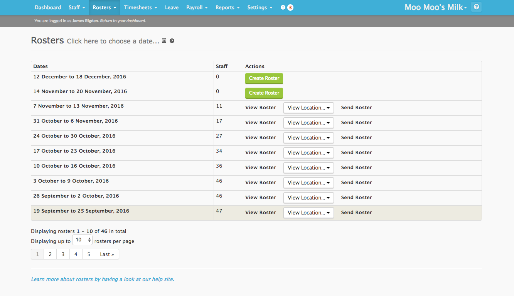

# Browse Rosters Page Redesign

This task is a challenge for designers and front end web developers.

The **browse rosters** page is the landing page for rostering completed in Tanda. This page is used by managers who create and send out rosters to their staff, it lists rosters for the current and future weeks. From this page managers can navigate to a specific weekly roster from the list, use the datepicker to jump to a different date or just send a roster out.

_Existing Browse Rosters Page_

This page is essentially a gateway that helps managers navigate to the roster they wish to view / edit. This is an important feature that should remain, but we think we can do more on this page in terms of its design, layout and the information we present.

## More Info

Here's a few more things you should know about rostering in Tanda. If you want to know something that isn't answered here, **please ask us!** Design is a two way street, so imagine us as the product manager, and ask any questions you normally would about why things are done in a certain way, or about what sort of information managers might want to see.

- We display costs on each roster, this is a very important bit of information for managers as it lets them make sure their roster costs aren’t going above budget.
- The date picker to switch between months is often missed by users as it doesn’t stand out, also many of the links on the page don’t look distinctly like links which can cause problems.
- We currently list 10 rosters on the page, these aren’t really organised by month and visually this makes it look less organised / harder to navigate.
- There are 3 links in the drop-down under the Rosters menu item. 1 is the browse page, and 2 are links to different views on a roster. Consider if this is the best way to structure the information, do we actually need dropdown links?

_Example Roster_

[Tanda demo accounts](https://my.tanda.co/try/?utm_source=Github&utm_medium=challenge&utm_campaign=design-front-end) also include sample leave requests so you can get more of a feel of what's going on.

## The challenge

Your challenge is to mock up a new design for the browse rosters page. You can submit just a picture of the mockup, but solutions that include complete HTML and CSS are better!

We want to see what you can come up with, don’t feel pressured to make your design look exactly like other pages in Tanda -  it's completely up to you. We want you to think about not only making the page look nice but also about making it useful for managers.

Feel free to use a framework like Bootstrap to build your designs.

## Submitting your code

Your code will probably be a HTML file, some CSS files, and maybe some JavaScript files. Please package those alongside the files we've given you (this doc etc) in a zip archive and email that to us. If you were emailed this task, just reply to whoever emailed it to you. Otherwise send it to developers@tanda.co
