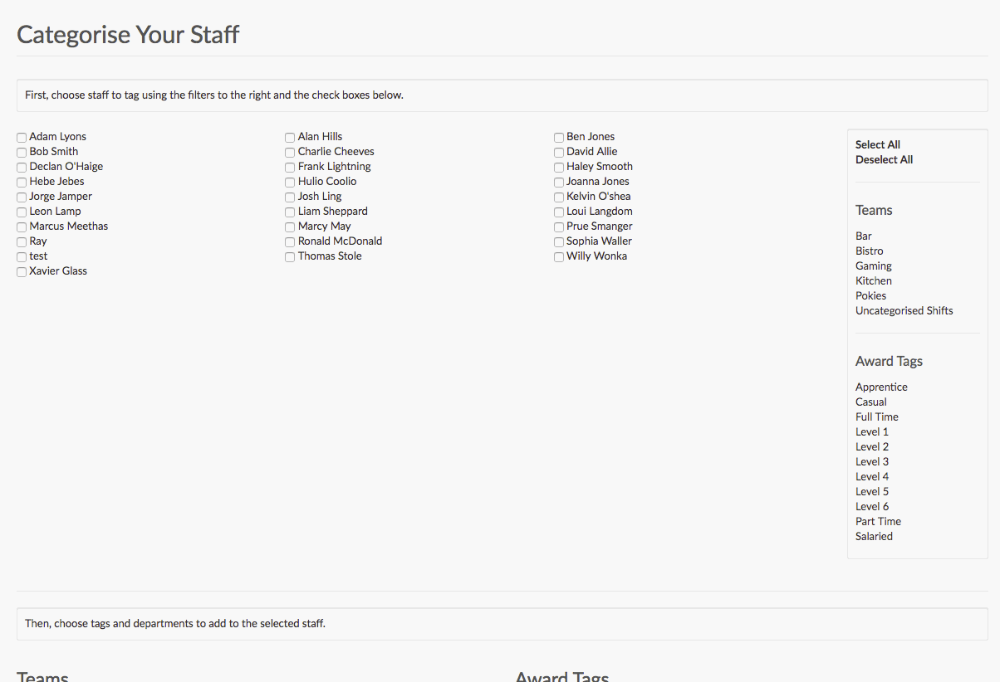

# Bulk Tagging Tool Redesign

This task is a challenge for designers and front end web developers.

When a business starts using Tanda for the first time, they need to make sure their staff are setup so they can be rostered and paid correctly.
This setup involves making sure staff are tagged with teams for rostering i.e. ‘bar’, ‘kitchen’ etc. and with award tags for payroll i.e. ‘casual’ for casual staff, ‘part time’ for part time staff.

For businesses with less than 15-20 staff they will often just go through and tag staff individually on their profiles however for larger businesses this can be very time consuming and it's quicker for them to do the tagging in one go.

We have a tool called 'bulk tagging' that allows them to do this. Unfortunately at the moment the layout and design on this page is clunky, unintuitive and managers can’t really use it without needing explanation from our support team over the phone.

_What the bulk tagging page looks like now_

## Your Challenge

Your challenge is to mock a redesign for the bulk tagging page, with the goal of making it so that any manager could immediately understand how to tag their staff into teams and award tags.

You can submit just a picture of the mockup, but solutions that include complete HTML and CSS are better!

We want to see what you can come up with, so don’t feel pressured to make your design look exactly like other pages in Tanda - it's completely up to you. Feel free to use a framework like Bootstrap to build your designs.

Things that we think need improving:

- The layout - we need a layout that is going to make this very simple task feel simple and not overwhelming
- Feedback to the user - right now after submitting the page there isn’t very much feedback or ‘summary’ given to the user to let them know what happened
- Complexity - do we need to show every possible tag and team at all times or could we reveal the options as required?
- UI - the current UI looks dated and lacking any real structure, how can we present the options in a nicer way
Communication - this page doesn't really have much in terms of help or guidance to the user, can we do a better job of explaining how things work?

How the page works now:

## More Info

Here's a few more things you should know about tagging in Tanda. If you want to know something that isn't answered here, please ask us! Design is a two way street, so imagine us as the product manager, and ask any questions you normally would about why things are done in a certain way, or about what sort of information managers might want to see.

- Staff can be put into multiple teams
- Staff can have multiple tags, usually they will be given a combination of a few tags
- Managers won’t necessarily need to tag teams and award tags at the same time - right now we have every possible option visible at all times.

You can signup for a free trail of Tanda to see how things work [Signup for a demo](https://my.tanda.co/try/?utm_source=Github&utm_medium=challenge&utm_campaign=design-front-end) Once you have an account you will find the bulk tagging tool in the tools menu via the my team page.

## Submitting your code

Your code will probably be a HTML file, some CSS files, and maybe some JavaScript files. Please package those alongside the files we've given you (this doc etc) in a zip archive and email that to us. If you were emailed this task, just reply to whoever emailed it to you. Otherwise send it to developers@tanda.co
