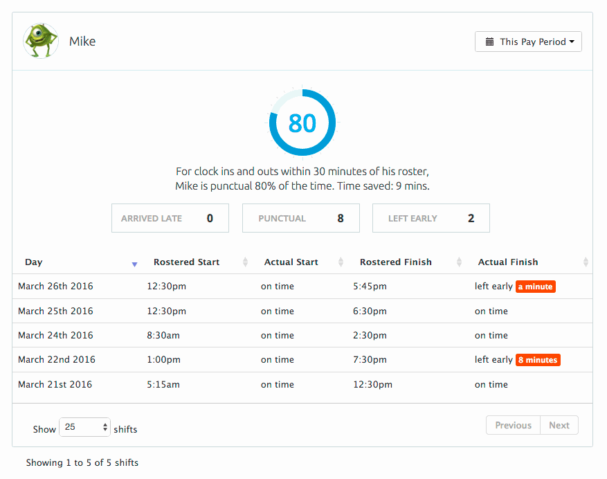

Punctuality
=================================

This task is a challenge for front-end focused developers.

Included in this package is a small Ruby web server, which returns data about rosters and shifts for a fictional person. Your task is to design and build a small widget that shows information about this person's punctuality.

This is a feature that already exists in Tanda; it looks like this:

Therefore, we are more interested in your ability to build some of the stuff you can see here. You're welcome to copy the design exactly and won't be penalised for doing so.

## Setting up

The file `punctuality.rb` has instructions on how to get the server running. Note that we don't expect you to have used Ruby before, and you won't be writing any Ruby code as part of this challenge, though you will probably have to read a little bit.

If you get stuck getting the server running, try Googling the error message, but feel free to email us if you hit a roadblock. Troubleshooting your errors, and knowing when to ask for help, are equally useful skills.

## The challenge

Once your server is set up, you should be able to visit it through a browser and see JSON data. Your next step is to start building the punctuality widget. The screenshot above includes quite a few features:

- Display rostered times for specific dates
- Display if corresponding actual time was on time, or if there was an issue with it
- Hover over actual time comment to see what the actual time was
- Date picker ("This Pay Period", also allows custom date selection)
- Pagination ("Show [25] shifts" / "Showing 1 to 5 of 5 shifts")
- Summary of times, through textual summary ("Mike is punctual 80% of the time"), chart, and summary of results ("punctual: 8, left early: 2")

Please build at least 3 of these features. It's your choice as to which 3, but at least some of your code should talk to the server you set up prior (it'd be pretty hard to make anything useful otherwise!).

Please don't use 3rd party code apart from utility libraries like jQuery (or equivalents), Underscore, Lodash, or Bootstrap. We recognise that this makes the task a bit more laborious, but we are interested in seeing your ability to write meaningful amounts of code, not glue libraries together. (Consider a hint as to the sort of work you'll be doing at Tanda.) If you'd like to write tests, we use QUnit, but feel free to use another framework if you have a preference.

You're welcome to build more than 3 features, but won't be penalised for not doing so. We're more interested in what your code looks like, then how much of it you write.

## Submitting your code

You're welcome to structure your code however you like. Please package in some sort of compressed archive format - zip is fine. In the archive please include everything we sent you, including the server code.