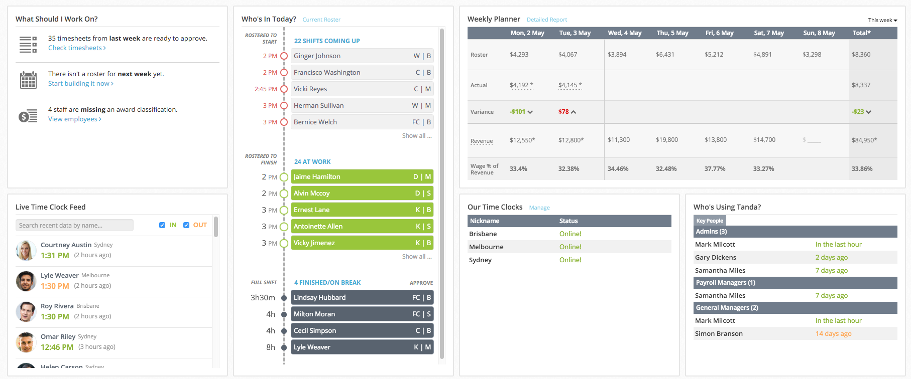

# Widget

This task is a challenge for designers and front end web developers.

The Tanda dashboard is the homepage that all users see when they first sign up, or log in, to the system. It contains a variety of widgets that link into different parts of the system, with the aim of giving customers an overview of how their staff are going, and if there's anything they need to get done. The dashboard can be configured to your liking, but the default view looks something like this:

As you can see, all information on the dashboard is provided in self contained widgets, each with a pretty specific focus. Your challenge is to design a new one!

One of the features of Tanda that the dashboard in the above screenshot doesn't touch on much is leave management - through Tanda, employees are able to request leave for upcoming holidays, or enter leave to be paid if they were off sick. Managers are able to approve or decline requests as well as looking at reports on leave history.

Your challenge is to mock up a new design for a leave dashboard widget. You can submit just a picture of the mockup, but solutions that include complete HTML and CSS are better!

## More info

Here's a few more things you should know about leave in Tanda. If you want to know something that isn't answered here, please ask us! Design is a two way street, so imagine us as the product manager, and ask any questions you normally would about why things are done in a certain way, or about what sort of stuff customers might want to see.

- The dashboard is visible to business owners and managers. At the moment, all widgets are visible to all users (in future we may add the option to disable widgets selectively). So your new widget should be more targeted at those approving/reviewing leave, than those requesting it.
- One of the core tenets of the dashboard's design is that it's read only - widgets should give a summary of what's going on, with deep links to the relevant page if something should be actioned. A secondary tenet is that the widget shouldn't be too cluttered - there's no point in including every bit of data we have in the system in such a small space.
- We think the main things the widget should do are to show pending (unapproved) leave requests, to show who is on leave now, and to show who will be on leave soon. Feel free to add other functionality if you think it's important.
- For extra credit, think about how the widget will look in an "empty" state (when there's no leave requests to display).

[Tanda demo accounts](https://www.tanda.co/try) also include sample leave requests so you can get more of a feel of what's going on.

## The challenge

You are welcome to submit a picture of a mockup, done using any tool you like. Or you're welcome to submit a solution in HTML/CSS (with Javascript added if you like) - these are encouraged.

This task is deliberately quite open ended. If you want more info about anything specific, send us your questions and we will get back to you as soon as we can.

By the way, we use the following general purpose frameworks/libraries at Tanda. Feel free to use any of these in your task.

- Bootstrap
- jQuery
- Underscore (Lodash is also okay)
- d3.js
- moment.js (and related plugins)
- QUnit (other test frameworks are okay)

## Submitting your code

Your code will probably be a HTML file, some CSS files, and maybe some JavaScript files. Please package those alongside the files we've given you (this doc etc) in a zip archive and email that to us. If you were emailed this task, just reply to whoever emailed it to you. Otherwise send it to developers@tanda.co
